# Unga Bunga User-Agent

A Firefox extension for user agent spoofing, with always up-to-date user agents and some nice features.

 [](LICENSE)
[](https://addons.mozilla.org/firefox/addon/unga-bunga-user-agent/)


## Table of Contents

- [Features](#-features)
- [Installation](#installation)
- [Quick Start](#quick-start)
- [Usage Guide](#usage-guide)
- [Site Modes](#site-modes)
- [Badge Indicators](#badge-indicators)
- [Updating User Agents](#updating-user-agents)
- [Troubleshooting](#troubleshooting)
- [Contributing](#contributing)
- [Acknowledgments](#acknowledgments)
- [License](#license)


## ✨ Features

<p float="center">
  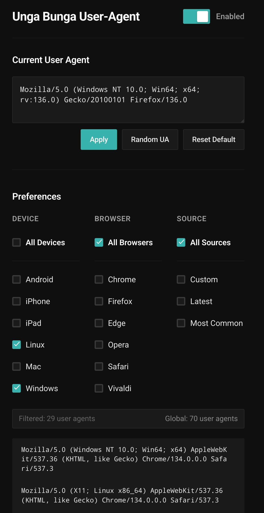
  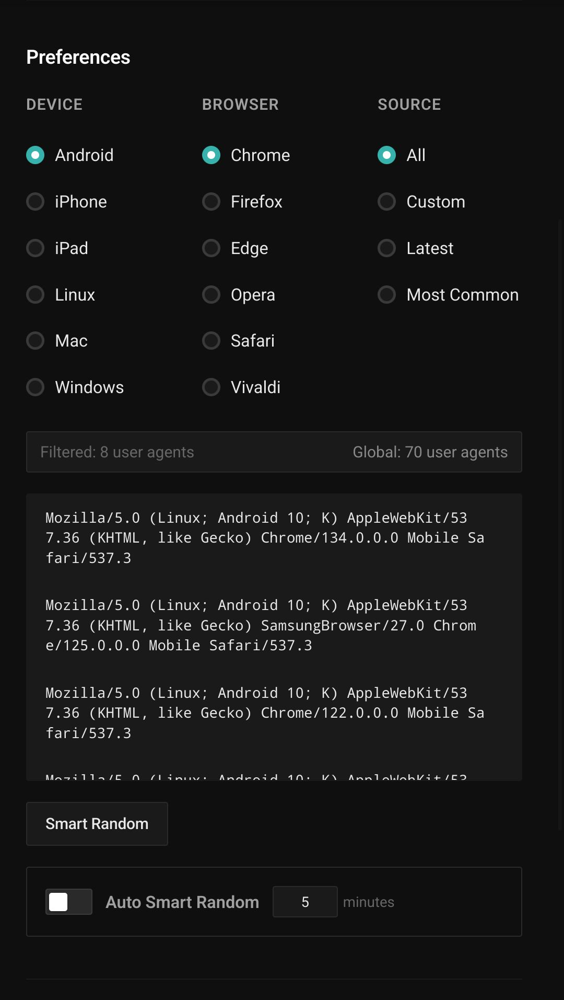
  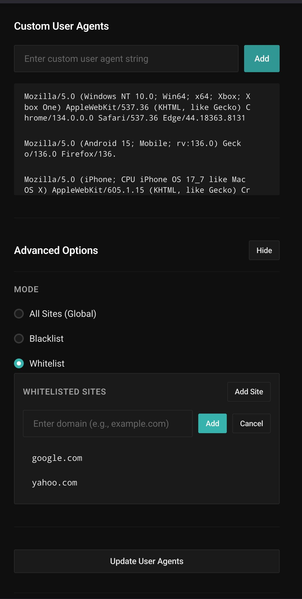
</p>

### Core Functionality

- **Filters**: select devices and browsers individually, by category, or all at once
- **Modes**: apply to all sites, a whitelist, or a blacklist
- **Custom User Agents**: add your own strings and keep them in a list
- **Smart Random**: picks a user agent that matches your filters
- **Auto Smart Random**: rotates the user agent on an interval

### Scope & Limitations

- Aims to provide consistent user-agent spoofing across common page contexts.
- Does **not** claim full anti-fingerprinting or undetectability. Some browser, engine and OS traits cannot be reached through WebExtension APIs.
- By default, strict parity avoids exposing `navigator.userAgentData` on engines that do not natively provide it.

### Modern Interface

- **Clean, minimal design**: dark theme with intuitive controls
- **Responsive layout**: desktop and mobile
- **Visual feedback**: toast notifications and status indicators


## Installation

### From Firefox Add-ons (recommended)

1. Visit the [Firefox Add-ons page](https://addons.mozilla.org/firefox/addon/unga-bunga-user-agent/)
2. Click "Add to Firefox"
3. Confirm the installation

### Manual installation (developer)

1. Download the extension files
2. Open Firefox and go to `about:debugging`
3. Click "This Firefox" → "Load Temporary Add-on"
4. Select the `manifest.json` file


## Quick Start

1. **Enable the extension** — click the toolbar icon and switch "Enabled" on.
2. **Choose a user agent** — pick from the filtered list, or use "Random UA" or "Smart Random".
3. **Check the badge** — the icon colour confirms the active mode.

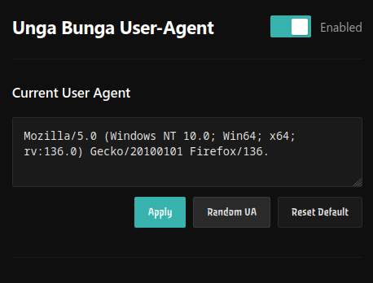


## Usage Guide

### Basic Controls

- **Text area**: view and edit the current user agent string
- **Apply**: apply the edited string
- **Random UA**: pick a random user agent from all available
- **Reset Default**: return to your browser's default user agent

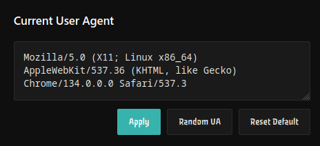

The list below the text area shows what your filters matched, and how many user agents exist in total.

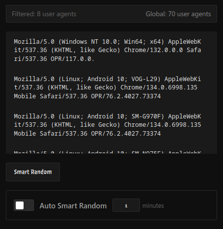

### Preferences

Pick any combination of filters — all, one, or several per category.

- **Device**: Android, iPhone, iPad, Linux, Mac, or Windows
- **Browser**: Chrome, Firefox, Edge, Opera, Safari, or Vivaldi
- **Source**: All, Custom, Latest, or Most Common
- **Smart Random**: pick a random user agent from the filtered results

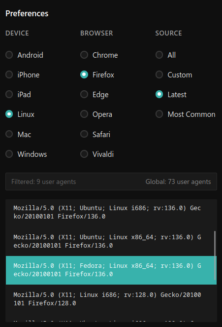

### Auto Smart Random

- **Toggle**: turn automatic rotation on or off
- **Interval**: 1-60 minutes
- **Selection**: draws from your device and browser filters

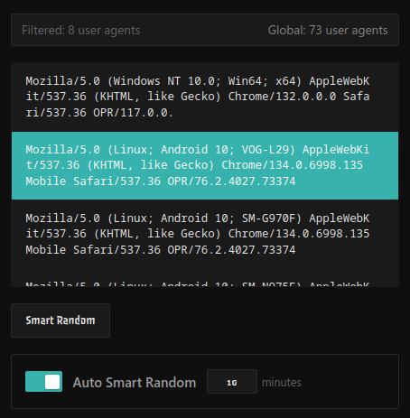

### Custom User Agents

- **Add**: enter your own user agent strings
- **Remove**: delete one with the × button
- **Persistent**: saved between sessions

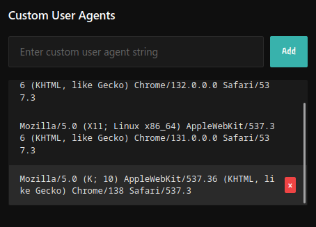


## Site Modes

Click "Advanced Options" in the popup to reach these.

### All Sites (default)

The user agent is applied everywhere. No site list to manage.

### Whitelist

The user agent is applied **only** to the sites you list. Every other site uses your real user agent.

### Blacklist

The user agent is applied everywhere **except** the sites you list.

### Managing the list

- **Add**: click "Add Site" and enter a domain, e.g. `example.com`
- **Remove**: hover over a site and click the × button
- Changes apply immediately.

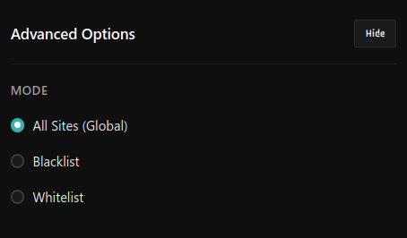
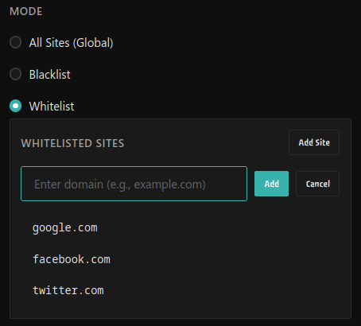


## Badge Indicators

The toolbar icon colour shows the current state:

| Badge  | Colour | Meaning                                 |
| ------ | ------ | --------------------------------------- |
| 🔴 OFF | Red    | Extension is off                        |
| 🟢 ALL | Green  | Applied to all sites                    |
| 🔵 WL  | Blue   | Applied only to whitelisted sites       |
| 🟣 BL  | Purple | Applied to all sites except blacklisted |

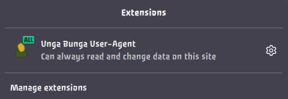


## Updating User Agents

- **Automatic**: the list is cached for 24 hours
- **Manual**: click "Update User Agents" to refresh now

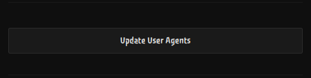


## Troubleshooting

**Badge not showing?**

- Reload the extension
- Check that the extension is enabled

**User agent not changing?**

- Ensure the extension is enabled
- Check the site against your whitelist or blacklist
- Try refreshing the page

**Advanced options not visible?**

- Click "Show" next to "Advanced Options" — the section is collapsed by default


## Contributing

Found a bug or have a feature request?
[Open an issue](https://github.com/ShrekBytes/unga-bunga-User-Agent/issues) or submit a pull request.

### Running the tests

```bash
npm test
```

No install step: the extension has no dependencies and the test runner is built
into Node, so Node 22 or newer is all you need. The tests cover the user agent
source fetching, the list that gets built from it, and the popup filters. See
[`tests/`](tests/) for details.


## Acknowledgments

- User agent data from [ShrekBytes/useragents-data](https://github.com/ShrekBytes/useragents-data)
- Useragents.me
- [UserAgent-Switcher](https://github.com/ray-lothian/UserAgent-Switcher) by ray-lothian


## License

This project is licensed under the GNU General Public License v3.0 - see the [LICENSE](LICENSE) file for details.
