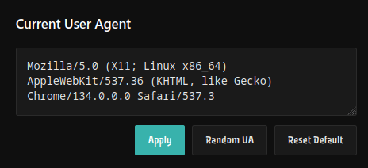
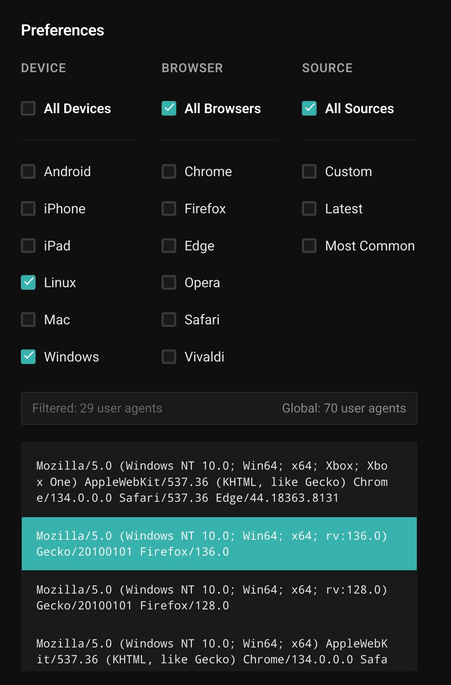
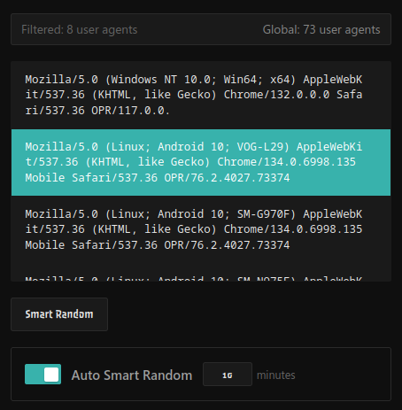

# Unga Bunga User-Agent

A powerful and user-friendly Firefox extension for advanced user agent spoofing with anti-detection features.


## 📋 Table of Contents

- [Features](#-features)
- [Installation](#-installation)
- [Quick Start](#-quick-start)
- [Usage Guide](#-usage-guide)
- [Advanced Features](#-advanced-features)
- [Badge Indicators](#-badge-indicators)
- [Troubleshooting](#-troubleshooting)
- [Contributing](#-contributing)
- [License](#-license)

## ✨ Features

### 🎯 Core Functionality

- **Smart User Agent Spoofing**: Automatically change your browser's user agent string
- **Anti-Detection**: Advanced features to prevent websites from detecting spoofing
- **Real-time Updates**: Live user agent changes without page refresh
- **Caching System**: Fast loading with intelligent caching of user agent lists

### 🎨 Modern Interface

- **Clean, Minimal Design**: Modern dark theme with intuitive controls
- **Responsive Layout**: Optimized for all screen sizes
- **Visual Feedback**: Toast notifications and status indicators
- **Collapsible Sections**: Advanced features hidden by default

### 🔧 Advanced Options

- **Multiple Modes**: All sites, Whitelist, or Blacklist operation
- **Custom User Agents**: Add your own user agent strings
- **Smart Random**: Intelligent user agent selection based on preferences
- **Auto-Random**: Automatic user agent rotation at set intervals

## 📦 Installation

### From Firefox Add-ons Store (Recommended)

1. Visit the Firefox Add-ons store
2. Search for "Unga Bunga User-Agent"
3. Click "Add to Firefox"
4. Confirm the installation

### Manual Installation (Developer)

1. Download the extension files
2. Open Firefox and go to `about:debugging`
3. Click "This Firefox" → "Load Temporary Add-on"
4. Select the `manifest.json` file


## 🚀 Quick Start

1. **Enable the Extension**

   - Click the extension icon in your toolbar
   - Toggle the "Enabled" switch to ON

2. **Choose a User Agent**

   - Select from the filtered list
   - Or use "Random UA" for automatic selection
   - Or use "Smart Random" for intelligent selection

3. **Apply Changes**
   - Your user agent is now active
   - Check the badge color for status confirmation


## 📖 Usage Guide

### Basic Controls

#### Current User Agent Section

- **Text Area**: View and edit the current user agent string
- **Apply Button**: Apply the edited user agent
- **Random UA**: Select a random user agent from all available
- **Reset Default**: Return to your browser's default user agent



#### Preferences Section

- **Device Filter**: Choose Android, iPhone, iPad, Linux, Mac, or Windows
- **Browser Filter**: Select Chrome, Firefox, Edge, Opera, Safari, or Vivaldi
- **Source Filter**: Choose from All, Custom, Latest, or Most Common user agents
- **Smart Random**: Intelligent selection based on your preferences



### Auto Smart Random

- **Toggle**: Enable/disable automatic user agent rotation
- **Interval**: Set rotation time (1-60 minutes)
- **Smart Selection**: Uses your device and browser preferences



### Custom User Agents

- **Add Custom**: Enter your own user agent strings
- **Remove**: Delete custom user agents with the × button
- **Persistent**: Custom agents are saved between sessions


## 🔧 Advanced Features

### Site-Specific Control

Click "Advanced Options" to access site-specific settings:


#### All Sites Mode (Default)

- User agent applied to all websites
- No site list management needed
- Perfect for general privacy

#### Whitelist Mode

- User agent applied ONLY to specified sites
- Add sites to the whitelist
- All other sites use your real user agent

#### Blacklist Mode

- User agent applied to all sites EXCEPT specified ones
- Add sites to the blacklist
- Excluded sites use your real user agent

### Site Management

- **Add Sites**: Click "Add Site" and enter domain (e.g., `example.com`)
- **Remove Sites**: Hover over a site and click the × button
- **Real-time Updates**: Changes apply immediately


## 🎨 Badge Indicators

The extension icon shows your current status:

| Badge  | Color  | Status    | Description                             |
| ------ | ------ | --------- | --------------------------------------- |
| 🔴 OFF | Red    | Disabled  | Extension is turned off                 |
| 🟢 ALL | Green  | All Sites | Working on all websites                 |
| 🔵 WL  | Blue   | Whitelist | Working only on whitelisted sites       |
| 🟣 BL  | Purple | Blacklist | Working on all sites except blacklisted |


## 🔄 Update User Agents

- **Automatic**: User agents are cached for 24 hours
- **Manual Update**: Click "Update User Agents" to refresh the list
- **Latest Sources**: Always get the most recent user agent strings


## 🛠️ Troubleshooting

### Common Issues

**Badge not showing?**

- Reload the extension
- Check if the extension is enabled

**User agent not changing?**

- Ensure the extension is enabled
- Check if the site is in blacklist/whitelist
- Try refreshing the page

**Advanced options not visible?**

- Click "Show" next to "Advanced Options"
- The section is collapsed by default


## 🤝 Contributing

We welcome contributions! Here's how you can help:

1. **Report Bugs**: Open an issue with detailed description
2. **Feature Requests**: Suggest new features via issues
3. **Code Contributions**: Fork the repository and submit pull requests
4. **Documentation**: Help improve this README

### Development Setup

```bash
git clone https://github.com/ShrekBytes/unga-bunga-User-Agent.git
cd unga-bunga-User-Agent
# Load as temporary add-on in Firefox
```

## 📄 License

This project is licensed under the GNU General Public License v3.0 - see the [LICENSE](LICENSE) file for details.

## 🙏 Acknowledgments

- User agent data from [ShrekBytes/useragents-data](https://github.com/ShrekBytes/useragents-data)
- Useragents.me
- Open source community

---

[](https://github.com/your-username/unga-bunga-User-Agent)
[](LICENSE)
[](https://addons.mozilla.org/firefox/addon/unga-bunga-user-agent/)
